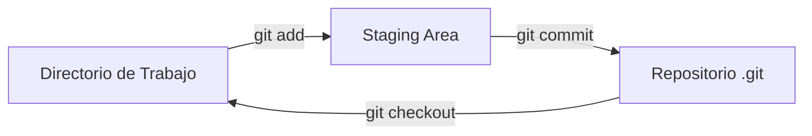

¡Excelente! El archivo **`01-fundamentos-git.md`** es donde explicamos la "magia" interna de Git. Para un ingeniero, entender que Git no es solo una carpeta de archivos, sino un sistema de gestión de estados, es la clave para no cometer errores después.

Vamos a validar la estructura de este archivo siguiendo tu estilo: **instrucciones en 2da persona** y **ejemplos/justificaciones en 1ra persona**.

---

# 🛠️ 01. Fundamentos de Git y Ciclo de Vida Local

Este archivo detalla cómo Git gestiona los archivos en tu computadora antes de que siquiera toquen internet. Es el corazón del control de versiones.

## 1. El Flujo de las Tres Áreas
Entiende que Git no guarda los cambios directamente. Los mueve a través de tres secciones lógicas. Imagínalo como una línea de producción:

1. **Directorio de Trabajo (Working Directory):** Donde están tus archivos actuales que editas en VS Code.
2. **Área de Preparación (Staging Area):** Una zona temporal donde agrupas los cambios que quieres incluir en la próxima "foto".
3. **Repositorio Local (.git):** El lugar donde se almacenan permanentemente todas las versiones (commits).




---

## 2. Los 4 Estados de un Archivo
Cada archivo en tu carpeta de proyecto puede estar en uno de estos estados. Aprende a identificarlos con el comando `git status`:

* **Untracked (No rastreado):** Archivos nuevos que Git no conoce. Aparecen en **rojo**.
* **Unmodified (Sin cambios):** Archivos que ya están guardados y no han sido tocados.
* **Modified (Modificado):** Archivos conocidos por Git que tienen cambios nuevos. Aparecen en **rojo**.
* **Staged (Preparado):** Archivos que ya pasaron al área de preparación. Aparecen en **verde**.


---

## 3. Comandos de Gestión Local
Utiliza estos comandos para mover tus archivos a través del ciclo de vida.

### Preparar los archivos (Add)
> **Mi consejo:** Yo suelo usar `git add .` cuando estoy seguro de que todos mis cambios son correctos, pero si solo quiero subir un archivo específico, uso su nombre.

```bash
# Agrego un archivo específico al Staging
git add 01-fundamentos-git.md

# Agrego TODO lo que esté modificado o sea nuevo
git add .
```

### Confirmar los cambios (Commit)
Un **Commit** es una "cápsula del tiempo". Genera un código único (SHA) que identifica ese momento exacto de tu proyecto.

```bash
# Tomo la foto con un mensaje descriptivo
git commit -m "Explicación de las 3 áreas y estados de archivos"
```

---

## 4. Visualización del Historial
Para verificar qué ha pasado en tu repositorio, utiliza el historial.

> **Mi truco de visualización:** Para no marearme con tanta información en la terminal de la **Predator Neo**, uso un formato resumido y gráfico.

```bash
# Ver el historial de forma lineal y compacta
git log --oneline

# Ver el historial con ramificaciones (Modo Pro)
git log --oneline --graph --all
```

---

## 5. ¿Me equivoqué? Cómo deshacer
Si cometiste un error, no entres en pánico. Git te permite volver atrás:

* **Modificar el último mensaje:** `git commit --amend -m "Nuevo mensaje"`.
* **Quitar del Staging (volver a rojo):** `git reset <archivo>`.
* **Deshacer el último commit (manteniendo tus archivos):** `git reset --soft HEAD~1`.

---

### ✅ Validación del Punto 1:
**¿Te parece que la explicación de las "3 Áreas" y los "4 Estados" es lo suficientemente clara para tu Wiki, o te gustaría que agreguemos un ejemplo real de cómo un archivo pasa de rojo a verde en la terminal?**

Si estás conforme, **¿pasamos a validar el archivo `02-flujo-remoto-github.md` para ver cómo se conectan estos commits locales con la nube?**